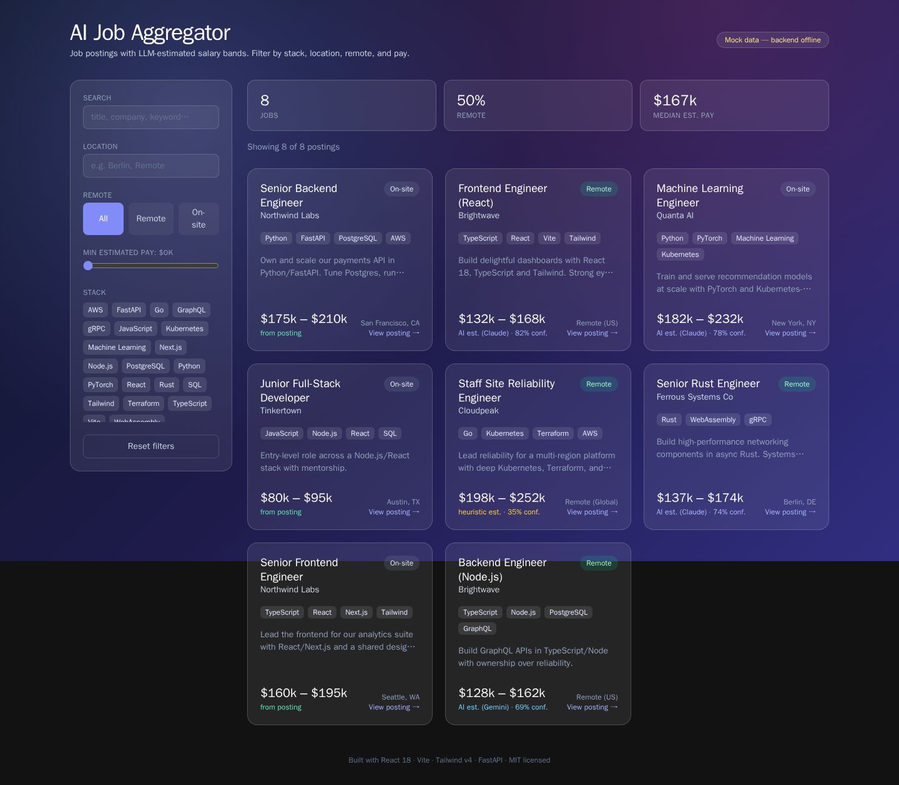
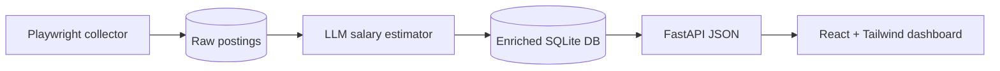

# AI Job Aggregator & Salary Estimator

> Collects job postings from public job boards, estimates a salary range for each using an LLM, and surfaces them in a clean React + Tailwind dashboard.

**🔗 Live demo:** https://antoniromera.github.io/ai-job-aggregator/ — the dashboard running on its built-in mock data (no backend required).

[](https://github.com/AntoniRomera/ai-job-aggregator/actions/workflows/ci.yml)




## Why

Most listings hide the salary. This tool fetches postings, runs them through an LLM to **estimate a realistic salary band** from the description (stack, seniority, location, remote), and lets you filter the market at a glance. It ships with a clearly-marked seed dataset so the whole thing runs **fully offline** — no network, no API keys.

## Features

- 🤖 **AI salary estimation** — provider-agnostic estimator: **Anthropic Claude (`claude-opus-4-8`, adaptive thinking) by default**, **Gemini (`gemini-2.0-flash`) as fallback**, and a **deterministic heuristic** when no key is set so it always works offline.
- 🧹 **Playwright collection** — headless Chromium with tenacity retry/backoff and per-domain rate limiting.
- ⚖️ **Responsible scraping** — `robots.txt` is checked before any live fetch; the default source is a bundled offline dataset.
- 📊 **Dashboard** — React 18 + Vite + Tailwind v4 glassmorphism UI; filter by stack, location, remote, and estimated pay. Mock-data fallback means `npm run dev` works with no backend.
- 💾 **Storage** — **SQLite** via SQLModel + aiosqlite; one-line swap to Postgres.
- ✅ **Tested & CI'd** — offline `pytest` suite for the backend, `vitest` + Testing Library for the frontend, and a GitHub Actions pipeline that lints, tests, and builds both stacks.

## Architecture



The pipeline (`collector/pipeline.py`) is: **collect → dedupe/store → enrich → persist**, exposed via `python -m collector run`.

## Getting started

### Offline (no network, no keys) — the default

```bash
# backend
python -m venv .venv && source .venv/bin/activate
pip install -r requirements.txt
python -m collector run        # loads the seed dataset, enriches with the heuristic estimator
python -m collector serve      # FastAPI at http://localhost:8000

# frontend (separate terminal)
cd web && npm install && npm run dev   # dashboard at http://localhost:5173
```

`npm run dev` renders immediately even if the backend isn't running — it falls back to a static mock dataset.

> **Requires Python 3.11+** (the backend uses modern typing and `datetime` features). Node 20+ for the frontend.

### With live LLM salary estimation

Set `ANTHROPIC_API_KEY` (preferred) or `GEMINI_API_KEY` in `.env`, then re-run:

```bash
cp .env.example .env   # add your key
python -m collector run
```

### With a live source (opt-in)

```bash
playwright install chromium       # one-time browser download
SOURCES=seed,remoteok python -m collector run
```

The `remoteok` adapter is robots-checked and rate-limited. The default `SOURCES=seed` never touches the network.

### CLI commands

| Command | Description |
|---------|-------------|
| `python -m collector run` | Collect → store → enrich (the main flow) |
| `python -m collector serve` | Start the FastAPI server |
| `python -m collector seed` | Load only the bundled seed dataset |
| `python -m collector estimate` | Re-run salary estimation over stored postings missing salary |
| `python -m collector sources` | List registered source adapters |

A `Makefile` wraps these: `make install`, `make run`, `make serve`, `make test`, `make web-dev`, …

## Tests & CI

```bash
# Backend
make install        # installs runtime + dev deps
make test           # pytest (fully offline — in-memory SQLite, heuristic estimator)
make lint           # ruff
make typecheck      # mypy

# Frontend
cd web
npm install
npm test            # vitest + Testing Library
npm run lint        # eslint
npm run build       # tsc + vite build
```

The backend suite covers the data models, typed settings, the deterministic
salary heuristic, the provider-selection factory (including the
Anthropic → Gemini → heuristic fallback chain), `robots.txt` enforcement (via
mocked HTTP), the async DB upsert/dedupe layer, the FastAPI endpoints (driven
through an in-process ASGI transport), and the full seed → store → enrich
pipeline. The frontend suite covers the client-side filtering/formatting
helpers, the backend-with-mock-fallback data layer, and the `JobCard`
component. Every test runs **without network access or API keys**.

GitHub Actions (`.github/workflows/ci.yml`) runs two jobs on every push and PR:
a **backend** job (`setup-python`, ruff, black, mypy, pytest) and a
**frontend** job (`setup-node`, eslint, vitest, vite build).

## Configuration

All variables have safe defaults (see `.env.example`); the project runs with none set.

| Variable | Default | Description |
|----------|---------|-------------|
| `ANTHROPIC_API_KEY` | _(empty)_ | Anthropic key. When set, Claude is the **default** salary estimator. |
| `GEMINI_API_KEY` | _(empty)_ | Gemini key. Used as the **fallback** estimator. |
| `LLM_PROVIDER` | `auto` | `auto` \| `anthropic` \| `gemini` \| `heuristic`. `auto` prefers Anthropic, then Gemini, then heuristic. |
| `ANTHROPIC_MODEL` | `claude-opus-4-8` | Anthropic model id. |
| `GEMINI_MODEL` | `gemini-2.0-flash` | Gemini model id. |
| `SOURCES` | `seed` | Comma-list of adapters: `seed` (offline), `remoteok` (live, opt-in). |
| `DB_URL` | `sqlite+aiosqlite:///collector/data/jobs.db` | SQLModel engine URL. Swap for a Postgres URL to scale. |
| `RATE_LIMIT_SECONDS` | `2.0` | Minimum seconds between requests to the same domain (live sources). |
| `USER_AGENT` | `ai-job-aggregator/0.1 …` | UA advertised to sites and used for robots.txt checks. |
| `CORS_ORIGINS` | `http://localhost:5173,…` | Allowed frontend origins. |

Frontend (`web/.env`):

| Variable | Default | Description |
|----------|---------|-------------|
| `VITE_API_URL` | `http://localhost:8000` | Backend base URL. |
| `VITE_USE_MOCK` | `false` | Force the static mock dataset instead of the backend. |

## Design decisions

1. **LLM model** — provider-agnostic estimator (`collector/llm/`). Abstract `SalaryEstimator` protocol with three impls: `anthropic_estimator.py` (default, `AsyncAnthropic` + `messages.parse()` with a Pydantic `SalaryEstimate` schema and adaptive thinking), `gemini_estimator.py` (fallback, `google-genai` structured output), and `heuristic_estimator.py` (offline backstop). The factory `get_estimator()` selects based on configured keys and degrades gracefully on failure.
2. **Storage** — SQLite via SQLModel + aiosqlite (`collector/db.py`). Zero infra for a demo; the engine URL is the only thing that changes to move to Postgres.
3. **Sources** — single permissive, automation-friendly setup. Default `seed` adapter reads `collector/data/seed_jobs.json` offline. Opt-in `remoteok` adapter is the worked real-board example, gated by `collector/robots.py`.
4. **Adapter contract** — documented `Source` protocol (`collector/sources/base.py`) + registry (`collector/sources/__init__.py`). Adding a board is one file plus one registry entry; `remoteok.py` is the reference.

## Project layout

```
collector/                Python backend
  __main__.py             CLI (run | serve | seed | estimate | sources)
  config.py               pydantic-settings config
  models.py               SQLModel tables + Pydantic schemas
  db.py                   async SQLite engine + query helpers
  robots.py               robots.txt allow/deny checks
  fetcher.py              Playwright manager (retry/backoff, rate limit)
  pipeline.py             collect -> store -> enrich orchestration
  api.py                  FastAPI app (GET /api/jobs, /api/jobs/{id}, /api/health, /api/meta)
  llm/                    provider-agnostic salary estimators
  sources/                source adapters (seed, remoteok) + registry
  data/seed_jobs.json     SAMPLE/SEED dataset (offline)
web/                      React 18 + Vite + Tailwind v4 dashboard
  src/lib/__tests__/      vitest tests (filters, api)
  src/components/__tests__/  vitest + Testing Library tests (JobCard)
tests/                    offline pytest suite (models, config, db, api,
                          robots, sources, estimators, pipeline)
.github/workflows/ci.yml  backend + frontend CI
```

## ⚖️ Responsible use

Respect each site's **Terms of Service and `robots.txt`**. This project targets boards that **permit automated access or offer an API**; it is **not** intended to scrape sites that prohibit it. `robots.txt` is enforced in code (`collector/robots.py`) before any live fetch, requests are rate-limited, and no personal data is collected. The default source is a bundled offline dataset.

## Roadmap

- [x] Documented source-adapter contract (`Source` protocol) + worked `remoteok` example
- [x] Offline pytest + vitest suites and GitHub Actions CI
- [ ] Export to CSV
- [ ] Demo GIF

## License

MIT © Antoni Romera Luis — see [LICENSE](LICENSE).
